Using Turtle Art JS
===================

Turtle Blocks Javascript is designed to run in a browser. Most of the
development has been done in Chrome, but it should also work in
Firefox. You can run it directly from index.html, from a [server
maintained by Sugar Labs](http://turtle.sugarlabs.org), from the
[github
repo](https://rawgit.com/sugarlabs/turtleblocksjs/master/index.html),
or by setting up a [local
server](https://github.com/sugarlabs/turtleblocksjs/blob/master/server.md).

Once you've launched it in your browser, start by clicking on (or
dragging) blocks from the Turtle palette. Use multiple blocks to
create drawings; as the turtle moves under your control, colorful
lines are drawn.

To write your own programs, drag blocks from their respective palettes
on the left side of the screen. Use multiple blocks in stack(s) to
create drawings; as the turtle moves under your control, colorful
lines are drawn.

Note that blocks either snap together vertically or
horizontally. Vertical connections indicate program (and temporal)
flow. Code is executed from the top to bottom of a stack of
blocks. Horizontal connections are used for parameters and arguments,
e.g., the distance to go forward, the degrees to rotate right, the
numerator and denominator of a division. From the shape of the block,
it should be apparent whether they connect vertically or horizontally.

Some blocks, referred to as "clamp" blocks have an
interior&mdash;child&mdash;flow. This might be code that is run *if* a
condition is true, or, more common, the code that is run over the
duration of a note.

For the most part, any combination of blocks will run (although there
is no guarantee that they will produce music). Illegal combinations
of blocks will be flag by a warning on the screen as the program runs.

You can delete a block by dragging it back into the trash area that
appear at the bottom of the screen.

To maximize screen real estate, Music Blocks overlays the program
elements (stacks of blocks) on top of the canvas. These blocks can be
hidden at any time while running the program.

Toolbars
--------

There are three toolbars: (1) the main toolbar across the top of the
screen; (2) the secondary toolbar on the right side of the screen; and
(3) the palette toolbar on the left side of the screen. An additional
menu appears when a "long press" (or "right click") is applied to a stack of
blocks. There is also a utility panel with additional controls.

Main toolbar
------------

The Main toolbar is used to run programs and to save and load projects.

On the left side of the main menu:

 Click on the *Run* button to run the blocks.

 Stop running the current project.

Under the secondary menu 
are additonal buttons to run the blocks slowly. When running slowly,
the values of parameter boxes are shown as an additional debugging
aid.

 to play back slowly.

 to play step-by-step (one block will run with each button press).

On the right side of the main menu:

 To start a new project.

 To save a project to the local file system of your computer.

 To open a saved project.

 To open a viewer for loading example projects and projects made by other Turtle Blocks users.

 Expand (or collapse) the auxillary toolbar.

 Show the help messages.

Canvas Toolbars
---------------

There are some additional buttons at the top of the canvas:

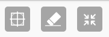

* The Show (or hide) grid button will display a pie menu with a variety of grid options.

* The Erase button will clear the screen and return the turtles to the center of the screen.

* The Screen button will shrink (or expand) the graphics area.

And there are some buttons on the bottom of the canvas:

* The Home buttom returns the blocks the center of the screen.

* The Hide button hides (or reveals) the blocks.

* The Collapse button collapses (or expands) stacks of blocks.

* The Shrink and Grow (magnifying glass) buttons change the size of the blocks.

Auxillary toolbar
-----------------

In addition to the run-slowly and step buttons described above:

Paste blocks from the clipboard. (This button is highlighted only when
there are blocks available on the clipboard to paste.) Copy is enabled
by a long press on a block.

Remove all blocks.

Restore blocks from the trash.

Show project statistics.

Load new blocks from plugins (previously downloaded to the file system).

Enable/disable scrolling.

Keyboard shortcuts
------------------

There are several keyboard shortcuts:

*PgUp* and *PgDn* will scroll the screen vertically. This is useful for
creating long stacks of blocks.

You can use the arrow keys to move blocks and the *Delete* key to
remove an individual block from a stack.

*Enter* is the equivalent of clicking the *Run* button.

*Alt-C* is copy and *Alt-V* is paste. Be sure that the cursor is
highlighting the block(s) you want to copy.

Block Palettes
--------------

The block palettes are displayed on the left side of the screen. The
palette button on the Main toolbar show and hide the block
palettes. These palettes contain the blocks used to create
programs. See the
[Programming Guide](http://github.com/sugarlabs/turtleblocksjs/tree/master/guide/README.md)
for more details on how to use the blocks.

Turtle Palette
--------------

Clear the screen and reset the turtle.

Move turtle forward.

Turn turtle clockwise (angle in degrees).

Move turtle backward.

Turn turtle counterclockwise (angle in degrees).

Move turtle along an arc.

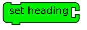

Set the heading of the turtle (0 is towards the top of the screen).

The current heading of the turtle (can be used in place of a number block)

Move turtle to position xcor, ycor; (0, 0) is in the center of the screen.

Current x-coordinate value of the turtle (can be used in place of a number block)

Current y-coordinate value of the turtle (can be used in place of a number block)

Pen Palette
-----------

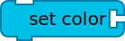

Set color of the line drawn by the turtle (hue, shade, and grey).

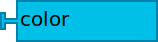

Current pen color (can be used in place of a number block)

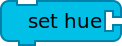

Set hue of the line drawn by the turtle (hue is the spectral color, e.g., red, orange, yellow, green, blue, purple, etc.).

Set shade of the line drawn by the turtle (shade is lightness, e.g., black, grey, white).

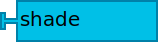

Current pen shade (can be used in place of a number block)

Set grey level of the line drawn by the turtle (grey is vividness or saturation).

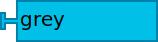

Current grey level (can be used in place of a number block)

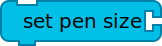

Set size of the line drawn by the turtle.

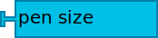

Current pen size (can be used in place of a number block)

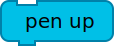

Turtle will not draw when moved.

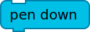

Turtle will draw when moved.

Draw filled polygon.

Set pen attribute to hollow line mode (useful for working with 3D printers).

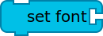

Set the font of the text drawn with Show Block.

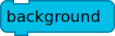

Set the background color.

Number Palette
--------------

Use as numeric input in mathematic operators (click to change the value).

Returns random number between minimum (top) and maximum (bottom) values

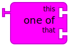

Returns one of two inputs as determined by a coin toss (random selection)

Adds two numeric inputs (also can be used to concatenate two strings)

Subtracts bottom numeric input from top numeric input

Multiplies two numeric inputs

Divides top numeric input (numerator) by bottom numeric input (denominator)

Calculates square root

Converts real numbers to integers

Returns top input modular (remainder) bottom input.

A programmable block used to add advanced single-variable math equations, e.g., sin(x).

Boolean Palette
---------------

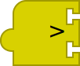

Logical greater-than operator

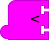

Logical less-than operator

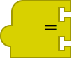

Logical equal-to operator

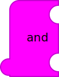

Logical AND operator

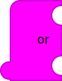

Logical OR operator

Logical NOT operator

Flow Palette
------------

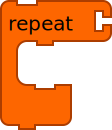

Loops specified number of times through enclosed blocks

Loops forever through enclosed blocks

Stops current loop or action

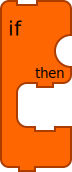

If-then operator that uses boolean operators to determine whether or not to run encloded "flow"

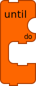

Do-until-True operator that uses boolean operators to determine how long to run enclosed "flow"

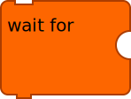

Waits for condition

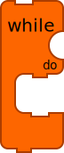

Do-while-True operator that uses boolean operators to determine how long to run enclosed "flow"

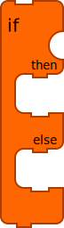

If-then-else operator that uses boolean operators to determine which encloded "flow" to run

Boxes Palette
-------------

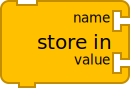

Stores value in named variable.

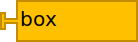

Named variable

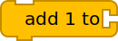

Adds 1 to named variable

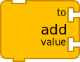

Adds numeric value to named variable

Named variable (name is passed as input)

Action Palette
--------------

Top of nameable action stack

Invokes named action stack

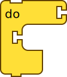

Invokes an action stack with arguments (To add more arguments, drag them into the clamp.)

Invokes an action stack that returns a value

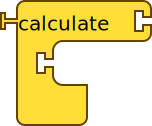

Invokes an action stack with arguments that returns a value

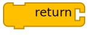

Returns a value from an action stack

An argument passed to an action stack

The first argument passed to an action stack

Connects action to toolbar run buttons (each Start Block invokes its own turtle)

Invokes named action stack (name is passed as input)

Connects an action with an event

Broadcasts an event (event name is given as input)

Media Palette
-------------

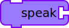

Speaks text

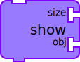

Draws text or shows media (from the camera, the Web, or the file system).

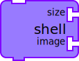

Puts a custom "shell" on the turtle (used to turn a turtle into a "sprite")

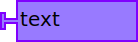

Text (string) value

Opens a file-open dialog to load an image (used with Show Block)

Accesses webcam (used with Show Block)

Opens a file-open dialog to load a video (used with Show Block)

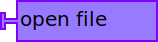

Returns the selected file (used with Show Block)

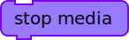

Stops the media being played

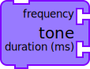

Plays a tone at frequency (Hz) and duration (in seconds)

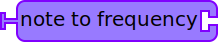

Converts notes to frequency, e.g., A4 --> 440 Hz.

Sensor Palette
--------------

Elapsed time (in seconds) since program started

Returns mouse X coordinate

Returns mouse Y coordinate

Returns True if mouse button is pressed

Holds results of query-keyboard block as ASCII

Returns pixel color under turtle

Microphone input volume

The "click" event associated with a turtle (used with Do Block)

Heap Palette
------------

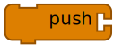

Push a value onto the heap.

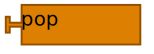

Pop a value off of the heap.

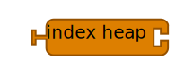

Reference an entry in the heap.

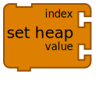

Change an entry in the heap.

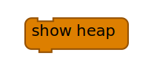

Display the contents of the heap.

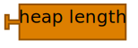

The length of the heap.

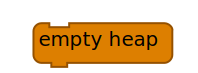

Empty the heap.

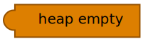

True is the heap is empty.

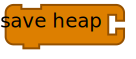

Save the heap to a file (JSON-encoded).

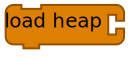

Load the heap from a file (JSON-encoded).

Extras Palette
--------------

Used to layout blocks vertically

Used to layout blocks horizontally

Pauses turtle a specified number of seconds

Prints value

Saves turtle graphics as an SVG file

Shows blocks and runs slowly (used to isolate code during debugging)

Hides blocks and runs at full speed (used to isolate code during debugging)

Plays media

Stops playing media
